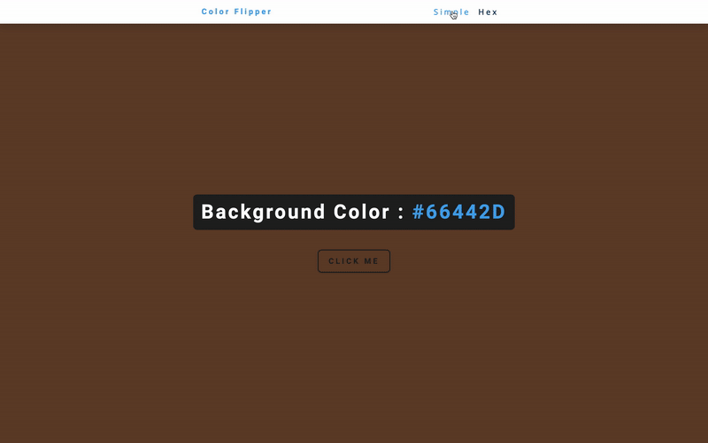
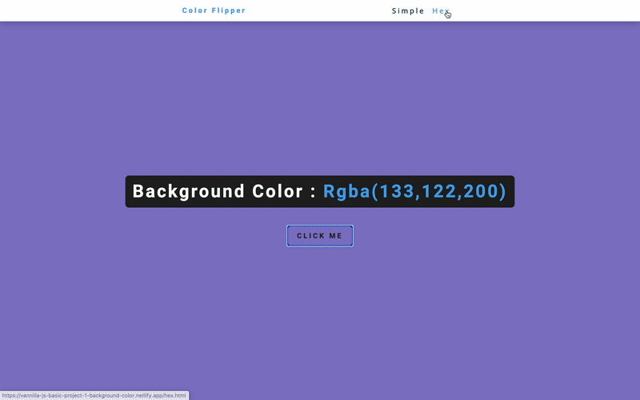

# Color Flipper

This project is to help you get comfortable with targeting elements and using a lot of what we have learned thus far together. It is meant to be fun and exciting and you can come back to this to implement things you have learned. 

A lot of the ideas will take you doing some research and asking questions. That is the point! So make sure to lean on your classmates and discover some cool stuff along the way together.


Color Flipper is a tool that allows a user to do change the background of the page by a click of button.

Your project can be styled according to your team's taste and what you invision for the persona that was selected.

This application has two modes: Simple and Hex.

**HINTS:** 
- PLAN OUT HOW you want to approach the project before starting.
- Make some issue tickets to help you keep focus and track (not mandatory, but recommended)
- use `document.querySelector('body').style.background = '{COLOR}';` to target the background color of the DOM.
- To get a random element from an array on click, you may need to set the background and .innerHTML to a function. Check out this resource to see how you may approach this: https://css-tricks.com/snippets/javascript/select-random-item-array/


### Simple View
- If the application is in simple mode when the user clicks the button, the background color will be chosen by predetermined colors.
  
  
  
### Hex View

- If the user is in hex mode, the color that will show after the button it pressed will be a completely random hex code color.
  
  

## Getting Started With Color Flipper

To get started with Color Flipper, follow these steps:

```
git clone <ADD_GITHUB_URL_HERE>
```

## Using Color Flipper

To use Color Flipper, follow these steps:

```shell
hs -o setup/index.html
```

## Acceptance Criteria
1. Scenario 1
    - **User story:** As a user, I want to be able to randomly select a color so that the background color of the page can be changed.
    - **Given** the user has navigated to the home page
    - **When** the user clicks on a button that reads "Click Me" in the center of the page
    - **Then** A random color should be chosen from an array of strings. 
       - Colors can be represented by hex code (`#ffffff`), rgba (`rgba(51, 170, 51, .7)`), rgb (`rgb(255, 0, 153)`), hsl (`hsl(270,60%,70%)`), hsla (`hsla(240, 100%, 50%, .7)`) and/or keyword (`forestgreen`)
    - **And:** The background color of the current page’s body should be changed to the chosen color
1. Scenario 2
    - **User story:** As a user, I want to be able to know exactly what background color has been chosen.
    - **Given** the user has navigated to any page
    - **When** the user wants to see what color is being displayed
    - **Then** above the button the background color’s text representation should be displayed
1. Scenario 3
    - **User story:** As a user, I want to be able to know where they are within the application
    - **Given** the user is on any page
    - **When** the user wants to know what page they are on
    - **Then** the name of the page they are on should be displayed somewhere on the screen.
1. Scenario 4
    - **User story:** As a user, I want to be able to navigate to any other available pages
    - **Given** the user is on any page
    - **When** the user wants to navigate to the hex page, or the simple page
    - **Then** the user should be able to click on a link in the Navbar that will take them to the correct page
1. Scenario 5
    - **User story:** As a user, I want to be able to randomly change the background color of the page to any hex code color.
    - **Given** the user has navigated to the Hex page
    - **When** the user clicks on a button that reads "Click Me" in the center of the page
    - **Then** a random hex code should be created
    - **And** the background color of the current page’s body should be changed to the new color
